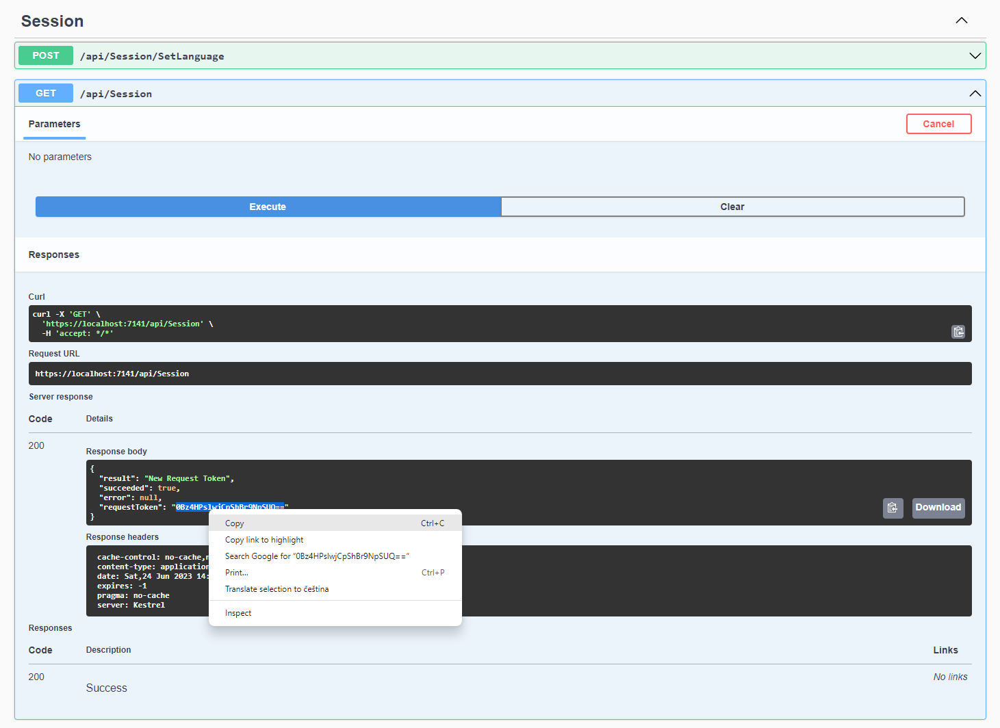
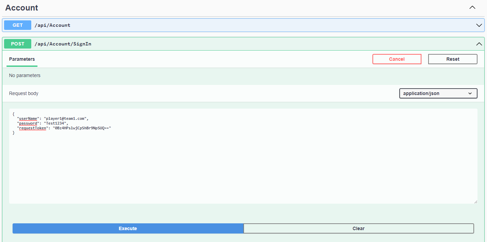
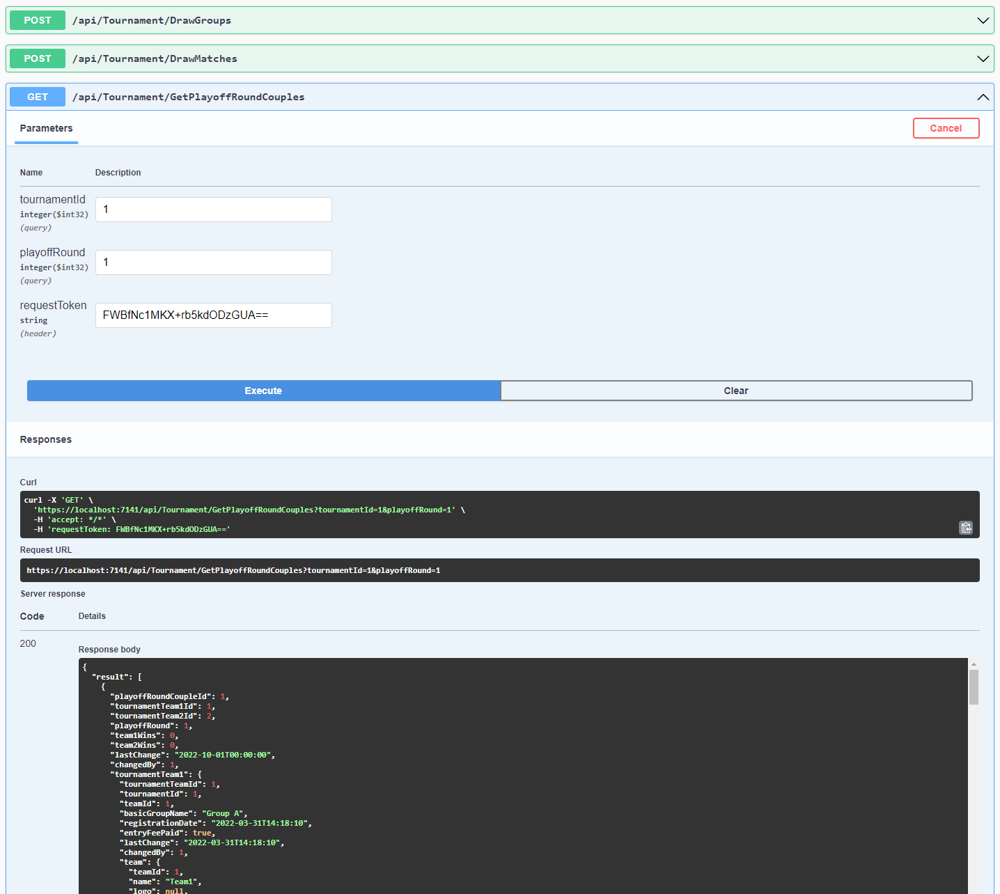
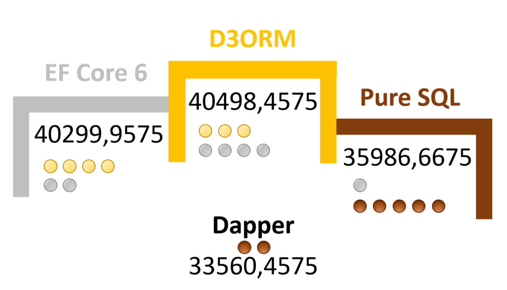

KLO128.D3ORM.Sample
===================

Welcome to the sample project for testing **KLO128.D3ORM**. This sample project focuses on sport pseudo information system covering many various data scenarios in relational SQL databases.

## How to Use the Sample?
1. Choose a database system:
    - Create a database using *Docs/`<DbSystem>`/create.sql* and optionally insert some data with *insert-test-data-`<dbsystem>`.sql* found in the same folder.
    - To use **MySQL** do not do anything with the app.
    - To use **MSSQL** or **SQLite**:
        1. Start Package Manager Console and run the EFCore class generation script found in: *KLO128.D3ORM.Sample.Infra.EFCore.`<DbSystem>`.Gen/ef-create.txt*.
        1. Run the text template to generate D3ORM entities: *KLO128.D3ORM.Sample.Infra.EFCore.`<DbSystem>`/gen/EntitiesFromEFCore.tt*
            - In case of SQLite, Run also *EntitiesFromEFCore-SQLiteFix.tt* to fix property types.
        1. For sure, run also *KLO128.D3ORM.Sample.Infra.D3ORM.`<DbSystem>`/EntityPropMappings.tt* and *KLO128.D3ORM.Sample.Domain/Models/Entities/EntityDTOs.tt*
        1. Replace the `KLO128.D3ORM.Sample.Infra.D3ORM.MySQL` reference with the new Infra reference according to chosen db system in `KLO128.D3ORM.Sample.Presentation.WebApi`.
1. Run the project `KLO128.D3ORM.Sample.Presentation.WebApi`.
1. Inside OpenApi window, find Session controller and run ***/api/Session/*** Copy the **request token** value into the clipboard.
   
1. Use the request token to sign in with the credentials, i.e.: player1@team1.cz/Test1234
    - The password is the same for all users.
    
1. Now, you can run any request as an authorized user with the admin role (as player1@team1.com).
   

[KLO128.D3ORM](https://d3orm.com)
==============

#### D3ORM is an object-relational-mapper (ORM), that supports own or generated entities, serialization to JSON, aggregation (to object trees) even with usage of stored procedures, DTO conversions, etc... High performance, easy to use and maintain...

> Did you know what is **[ORM](https://d3orm.com/en-US/Documentation/Quick-Start#WhatIsORM)** used for? (generally)

Many companies flirts with NoSQL databases, because they can aggregate data into documents, which can be quite a low cost for specific cases and also you are able to divide data on more drives with no need of RAIDs with NoSQL. So, it is scalable horizontally in a better way. However, the biggest disadvantage is data update - you have to look everywhere, because the data are bound into the documents with a lot of dependencies (to make reading more effective) which can repeat in other documents. You have to go through all the database to update all the duplicities. Relational SQL database systems own IT gigants that guarantees great performance when it comes to parallelism, searching and storing data for any case. Unfortunately, there are not many choices of quality object-relational-mappers at the market. D3ORM, with all the features, could be the right choice for new projects or renewals. With D3ORM's **light architecture**, you will not be trapped anymore when you decide to start using other SQL database, ORM or NoSQL database in your project...

> The name **D3ORM** is derived from Domain Driven Design Object-Relational-Mapper as it perfectly suits the DDD usage rules, but it can be used in any other modern architectural design patterns.

## Quick Start

Do not hesitate and [start](https://d3orm.com/en-US/Documentation/Quick-Start) right now.

**See also**
- [FAQ](https://d3orm.com/en-US/Documentation/FAQ)
- [Code Generators](https://d3orm.com/en-US/Documentation/Code-Generators)
- Sample Project: [KLO128.D3ORM.Sample | GitHub](http://github.com/KLO128/KLO128.D3ORM.Sample)

## Supported Databases
- MSSQL: [KLO128.D3ORM.MSSQL](https://d3orm.com/en-US/Documentation/MSSQL-Library)
- MySQL: [KLO128.D3ORM.MySQL](https://d3orm.com/en-US/Documentation/MySQL-Library)
- Oracle: comming soon...
- SQLite: [KLO128.D3ORM.SQLite](https://d3orm.com/en-US/Documentation/SQLite-Library)

# Key Features

[Light Layered Architecture](https://d3orm.com/en-US/Documentation/Architecture)
------------------
- Own or [Generated](https://d3orm.com/en-US/Documentation/Code-Generators/EntitiesFromEFCore) Entities
- Light generated repository [interfaces](https://d3orm.com/en-US/Documentation/Code-Generators/Repositories-Ifaces) and [implementations](https://d3orm.com/en-US/Documentation/Code-Generators/Repositories-Impl) are decorations with no coding or you can adapt the repositories with minimal coding but no impact on layers.
- Zero Maintenance of [App &lt;--&gt; Db Mappings](https://d3orm.com/en-US/Documentation/Code-Generators/EntityPropMappings)
- DTO Support at [Query](https://d3orm.com/en-US/Documentation/Common-Abstract-Library/ISpecification-TEntity#AsDTO) or [Server](https://d3orm.com/en-US/Documentation/Common-Abstract-Library/DTO-Extensions) Side

Aggregation (Object Trees)
--------------------------

Flat SQL query results with relations are structured into object trees according to the structure of **your own or [generated](https://d3orm.com/en-US/Documentation/Code-Generators/EntitiesFromEFCore) entities**.

For DTO, you can use the [DTO Query](https://d3orm.com/en-US/Documentation/Common-Abstract-Library/ISpecification-TEntity#AsDTO) inside a query specification or  [Entity -&gt; DTO Extensions](https://d3orm.com/en-US/Documentation/Common-Abstract-Library/DTO-Extensions) with generated [DTO classes](https://d3orm.com/en-US/Documentation/Code-Generators/EntityDTOs) at the server side... Using AVG, COUNT, MIN, MAX, SUM functions, you can get Expando objects or DTOs as well.

[Queries](https://d3orm.com/en-US/Documentation/Queries)

[Stored Procedures](https://d3orm.com/en-US/Documentation/Queries#storedProcedures)
-----------------
If you follow the simple naming rules of stored procedure's query result, you can take an advantage of the **aggregation**.

[Async Bulk Operations](https://d3orm.com/en-US/Documentation/Bulk-Operations)
---------------------
Supports anonymous and asynchronous bulk operations! (update and delete)

JSON Serialization
------------------
Entity Results do not contain cyclic references and are serializable as they are (without any action needed). Of course, you can take an advantage of [Entity -&gt; DTO Extensions](https://d3orm.com/en-US/Documentation/Common-Abstract-Library/DTO-Extensions) or [DTO Query](https://d3orm.com/en-US/Documentation/Common-Abstract-Library/ISpecification-TEntity#AsDTO).

[Specification Pattern](https://d3orm.com/en-US/Documentation/Queries)
---------------------
Build query specifications with joins, (nested) filters, sorting etc. using `And(), Or(), Compare(), CompareFormat(), In[Format](), NotIn[Format](), OrderBy()`, etc...

We also plan to prepare LINQ implementations of [ISpecification](https://d3orm.com/en-US/Documentation/Common-Abstract-Library/ISpecification-TEntity) functions to be able to return back to Entity Framework with a clean architecture.

Known Issues
------------
- Due to an obfuscator, we use to protect our code, we do not support our libraries to be used directly on Android or iOS, yet. For now, use a Web API client only on Android/iOS.

##### Please respect the rules of reporting issues:
- Try to find out the error on your side, first!
   - i.e.: an error of poorly defined query where you can accidentally join tables with no relation in between... [D3Error-001](https://d3orm.com/en-US/Documentation/FAQ#D3Error-001)
- Try to find an existing question at GitHub or at [FAQ](https://d3orm.com/en-US/Documentation/FAQ) similar to yours.
- If you still could not resolve your problem and you think the issue is on our side, report it here: [D3ORM Issues | GitHub](http://github.com/KLO128/KLO128.D3ORM.Sample/issues)

[High Computing Performance](https://d3orm.com/en-US/Documentation/Performance)
------------------

D3ORM has been load tested and compared to Entity Framework, Pure SQL and Dapper with the best results upon various big data scenarios.

|                       |        | **Transactions** |  **RAM**        | **Errors** | **Multitasking**    |         | **Transactions** |  **RAM**    | **Errors** | **Multitasking** |         | **Transactions** |  **RAM**       | **Errors**  | **Multitasking**     |         | **Transactions**       |  **RAM**              | **Errors**            | **Multitasking**       |
| --------------------- | ------ | ---------------- |  --------       | ---------- | ----------------    | ------- | ---------------- |  ---------  | ---------- | ---------------- | ------  | ---------------- |  ----------    | ----------- | ----------------     | ------- | ---------------------- |  -------------------- | --------------------- | ---------------------- |
| **Scheme1 100r 50u**  | **D3** | 6473             |  128            | 0          | 00:02:21.85         | **DPR** | 6092             |  222        | 0          | 00:02:24.05      | **EF6** | 6340             | 169            | 0           | 00:02:23.55          | **SQL** | 6041                   | 165                   | 0                     | 00:02:24.06            |
| **Scheme1 100r 100u** | **D3** | 5888             |  128            | 0          | 00:02:34.26         | **DPR** | 6277             |  222        | 0          | 00:02:35.39      | **EF6** | 6180             | 169            | 0           | 00:02:35.02          | **SQL** | 5958                   | 165                   | 0                     | 00:02:32.24            |
| **Scheme1 400r 50u**  | **D3** | 3821             |  534            | 0          | 00:02:21.40         | **DPR** | 3677             |  1471       | 0          | 00:02:20.99      | **EF6** | 3084             | 1358           | 0           | 00:02:21.40          | **SQL** | 3984                   | 338                   | 0                     | 00:02:21.93            |
| **Scheme1 400r 100u** | **D3** | 3831             |  534            | 0          | 00:02:31.77         | **DPR** | 3617             |  1471       | 0          | 00:02:33.07      | **EF6** | 3440             | 1358           | 0           | 00:02:15.46          | **SQL** | 3816                   | 338                   | 0                     | 00:02:37.92            |
| **Scheme2 100r 50u**  | **D3** | 4040             |  467            | 0          | 00:02:19.26         | **DPR** | 2092             |  3555       | 0          | 00:02:39.36      | **EF6** | 4378             | 411            | 0           | 00:02:17.86          | **SQL** | 2963                   | 613                   | 0                     | 00:02:28.92            |
| **Scheme2 100r 100u** | **D3** | 3987             |  467            | 0          | 00:02:31.04         | **DPR** | 1988             |  3555       | 0          | 00:02:58.21      | **EF6** | 3993             | 411            | 3           | 00:02:26.76          | **SQL** | 2757                   | 613                   | 0                     | 00:02:41.61            |
| **Scheme2 400r 50u**  | **D3** | 1422             |  476            | 0          | 00:02:43.59         | **DPR** | 891              |  9994       | 0          | 00:05:36.88      | **EF6** | 1531             | 1287           | 0           | 00:02:37.71          | **SQL** | 986                    | 3808                  | 0                     | 00:03:28.59            |
| **Scheme2 400r 100u** | **D3** | 1468             |  476            | 0          | 00:03:09.57         | **DPR** | 1181             |  9994       | 47         | 00:07:58.10      | **EF6** | 1606             | 1287           | 0           | 00:02:58.87          | **SQL** | 1122                   | 3808                  | 0                     | 00:04:17.45            |
| **Scheme3 100r 50u**  | **D3** | 3119             |  198            | 0          | 00:02:35.04         | **DPR** | 3402             |  581        | 0          | 00:02:29.23      | **EF6** | 3553             | 214            | 0           | 00:02:30.82          | **SQL** | 2989                   | 261                   | 0                     | 00:02:36.11            |
| **Scheme3 100r 100u** | **D3** | 3711             |  198            | 0          | 00:02:41.78         | **DPR** | 3278             |  581        | 0          | 00:02:38.15      | **EF6** | 3643             | 214            | 1           | 00:02:57.06          | **SQL** | 3535                   | 261                   | 0                     | 00:02:31.94            |
| **Scheme3 400r 50u**  | **D3** | 1486             |  202            | 51         | 00:03:48.31         | **DPR** | 1416             |  2526       | 21         | 00:04:00.48      | **EF6** | 1562             | 354            | 20          | 00:03:22.18          | **SQL** | 1341                   | 655                   | 37                    | 00:03:50.27            |
| **Scheme3 400r 100u** | **D3** | 1848             |  202            | 1          | 00:03:10.16         | **DPR** |1358              |  2526       | 16         | 00:03:31.00      | **EF6** | 1640             | 354            | 3           | 00:03:06.01          | **SQL** | 1640                   | 655                   | 50                    | 00:03:57.70            |
| **OVERALL**           | **D3** | **41094 (1)**    |  **314.17 (1)** | **52 (2)** | **00:02:44.00 (2)** | **DPR** | **35269**        | **3058.17** | **84 (3)** | **00:03:28.71**  | **EF6** | **40750 (2)**    | **632.17 (2)** | **27 (1)**  | **00:02:39.39 (1)**  | **SQL** | **37082 (3)**          | **973.33 (3)**        | **87**                | **00:02:59.06 (3) **   |

### Benchmark

**Benchmark = Transactions - RAM/4 - (Errors)\*8 - (multitaskingIteration(seconds) - 140)\*4**

 {.doc-index-picture.float-end}

> Pure SQL is not so fast because it reads data sequentially while D3ORM and EF Core skips the columns in a row of already processed aggregates.

## License
D3ORM is licensed as a proprietary software that can be used and integrated into your systems or products as a tool. (Re)distribution, modification or copying the software in order to provide or sell the software to third parties is prohibited.

Please check the license agreement carefully before you start using the software: [License | KLO128.D3ORM](https://d3orm.com/en-US/License).
